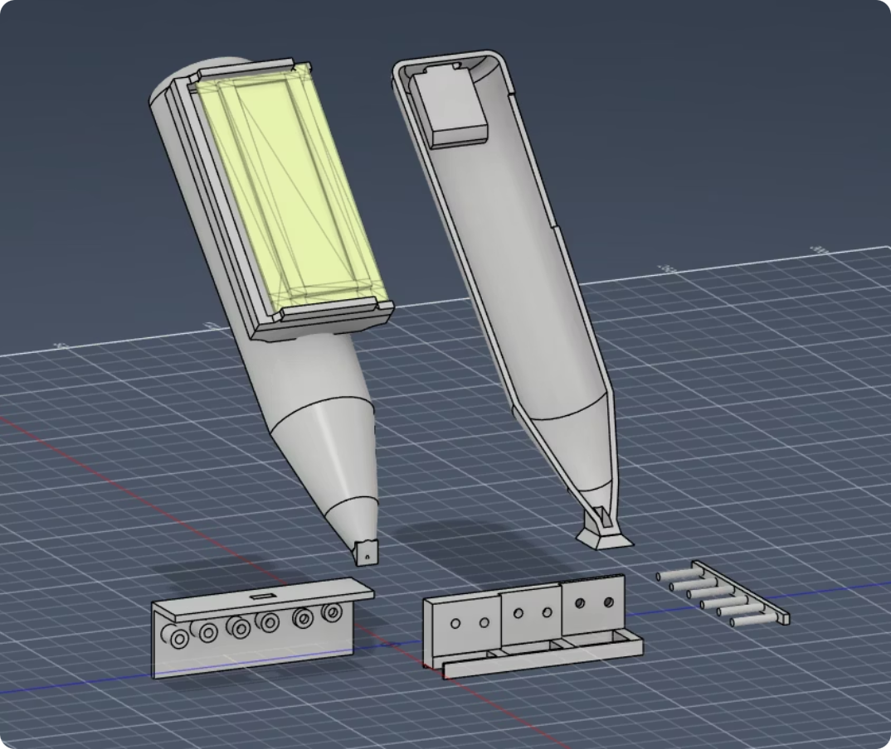

# BrailleScan Tactile Reader

BrailleScan este un dispozitiv experimental care detectează și interpretează caractere Braille folosind un sistem mecanic și optoelectronic. Proiectul combină electronică embedded, mecanică, procesare de imagine și dezvoltare software pentru a crea o soluție portabilă de accesibilitate.

---

# 1. Overview

BrailleScan Tactile Reader este un sistem care transformă punctele Braille în date digitale interpretabile. Dispozitivul poate fi utilizat direct pe suprafețe care conțin text Braille, fără a necesita un format special de introducere.

Proiectul explorează două direcții:
- detecție mecanică (prototip principal)
- detecție optică prin cameră (experimental)

---

# 2. Problem Statement

Majoritatea soluțiilor existente pentru citirea Braille:
- sunt costisitoare
- sunt voluminoase
- necesită dispozitive fixe
- sau funcționează doar cu suporturi dedicate

Acest lucru limitează accesibilitatea în utilizarea de zi cu zi.

BrailleScan își propune o alternativă:
- compactă
- accesibilă
- portabilă
- și ușor de utilizat pe suprafețe reale

---

# 3. Inspiration & Concept

Ideea proiectului a apărut în urma unui curs la HKA unde au fost studiate:
- algebra booleană
- reprezentări binare
- coduri Hamming
- detectarea și corectarea erorilor

S-a observat o corespondență directă între:
- Braille (6 puncte active/inactive)
- și reprezentarea binară (1/0)

Această analogie a stat la baza proiectului.

---

# 4. System Architecture

Fluxul principal al sistemului:
Microswitches → ESP32 SuperMini → LCD Display
Componente:
- ESP32 SuperMini (control + procesare)
- microcomutatoare cu rolă (detecție fizică)
- LCD (afișare stare și rezultate)
- structură printată 3D (suport mecanic)
- alimentare USB-C 5V

LCD afișează:
- starea fiecărui senzor
- șirul de caractere detectate

---

# 5. Mechanical Design

Sistemul mecanic este realizat prin:
- CAD + printare 3D
- structură compactă și modulară
- aliniere defazată a senzorilor

Microcomutatoarele sunt alese deoarece:
- au forță mică de activare (~0.05N)
- nu deteriorează suprafața Braille
- oferă semnal stabil

Designul este ușor de modificat și calibrat.

---

# 6. Prototype Evolution

Au fost testate mai multe metode:

- SMD tactile buttons → forță prea mare, instabile
- pogo pins → semnal inconsistent
- IR sensors → dificultăți de miniaturizare
- microswitch rollers → soluția finală
- camera-based detection → experimental

Procesul de dezvoltare a fost iterativ, fiecare variantă contribuind la îmbunătățirea finală.

---

# 7. Optical Recognition (Experimental)

Sistemul optic utilizează computer vision pentru detectarea punctelor Braille.

## Processing pipeline:
- grayscale conversion
- margin detection
- Gaussian blur
- adaptive threshold
- morphological filtering
- contour detection
- CLAHE enhancement
- TopHat transform
- KD-tree filtering
- non-max suppression
- final rendering

## Stack:
- Python
- OpenCV
- NumPy
- SciPy (KDTree)

Rezultatele sunt bune în condiții ideale, dar sensibile la:
- iluminare
- unghi
- calitatea imaginii

---

# 8. Web Interface (Camera System)

Pentru componenta optică există un site experimental care permite:

- upload de imagini (Windows)
- captură foto (Android)
- procesare Braille în browser
- afișare puncte detectate

## Tech stack:
- React
- TypeScript
- Vite
- Firebase Hosting

Site-ul are rol demonstrativ și de testare rapidă a algoritmului.

---

# 9. Software Design

Software-ul embedded:
- citește semnalele digitale
- convertește inputul în reprezentare binară
- interpretează caractere Braille
- afișează rezultatul pe LCD

Codul este:
- modular
- extensibil
- pregătit pentru funcții viitoare (AI / networking)

---

# 10. Testing & Limitations

## Testing method:
Testarea se face prin compararea:
- datelor afișate pe LCD
- cu relieful Braille observat fizic

## Current performance:
- precizie estimată: 55% – 75%
- depinde de calibrare și aliniere

## Limitations:
- sensibilitate mecanică
- calibrare dificilă
- variații în presiune
- sistem optic dependent de condiții externe

---

# 11. Roadmap & Future Work

## Hardware:
- miniaturizare (dificilă din cauza componentelor disponibile)
- stabilizare mecanică
- optimizare carcasă

## Software:
- interpretare mai robustă
- integrare corectare erori (inspirat din coduri Hamming)
- output audio
- conectivitate cloud

## Optical system:
- îmbunătățire algoritmi CV
- stabilitate la lumină variabilă
- integrare în timp real

---

## 12. Media & 3D Design Files

### Prototype Overview

  

The image above shows the current physical prototype of the BrailleScan system, including the 3D printed structure designed to hold and align the microswitch-based detection mechanism.

---

### 3D Printed Components

The mechanical system is composed of multiple modular parts designed for flexibility and iterative improvement:

- Base Structure (v1.1 STL): `assets/BrailleBaseAlex1.1.stl`
- Base Structure (v1.2.3 MF): `assets/BrailleBaseAlex1.2.3mf`
- Center Frame: `assets/BrailleCenter.stl`
- Bottom Support: `assets/BrailleBottom6.stl`
- Connector Module: `assets/BrailleConnector.stl`

---

### Notes on Design

The system was designed in a modular way to allow:
- fast iteration of mechanical alignment
- easier calibration of microswitch positioning
- structural stability improvements over multiple versions

The design is still under refinement, especially in terms of precision alignment between sensing elements.

# Repository

GitHub repository:
https://github.com/DoctorBeryl/BrailleScan
